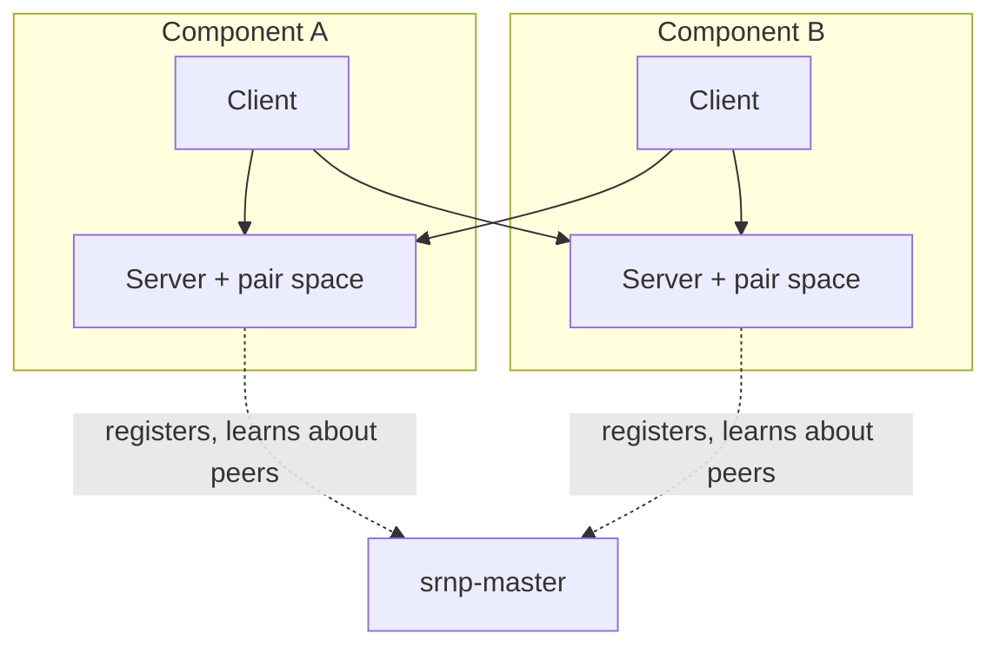
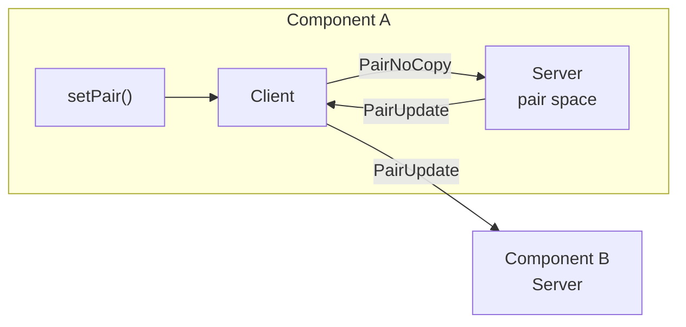

# Architecture

> Describes `src/master_hub.cpp`, `src/server.cpp`, `src/client.cpp`,
> `src/srnp_kernel.cpp`.

## The shape of a system

Dotted lines carry only registration and peer lists. Pairs travel the solid ones.
The master never sees a pair.

## The master

`MasterHub` accepts connections, assigns owner ids, and keeps the list of live
components. Each connection is a `MasterHubSession` that reads exactly one
message — `IndicatePresence` — replies with `MasterMessage`, and then blocks on a
read that only completes when the component disconnects. That read is how the
master notices a component leaving.

Owner ids are derived from the component's port: the port seeds a generator that
picks a number in [1000, 10000), and collisions step forward by one. Seeding from
the port means a component restarting on the same port usually keeps its id,
which makes logs readable across restarts.

When a component joins or leaves, the master sends `UpdateComponents` to everyone
else. The component it is about is skipped — it already knows.

## A component

A component is one `Server` and one `Client` sharing a `PairSpace` and a
`PairQueue`, all held by `KernelInstance` as process-wide singletons.

**The server** owns the pair space. It accepts connections from other components'
clients, and from our own. Everything that changes the pair space goes through a
`ServerSession`.

**The client** is the only thing that sends. It holds one `ClientSession` per
component it knows about, plus one to our own server. The one to our own server
is the only one it reads from.

That asymmetry is the core of the design: writes fan out from the client, reads
land at the server, and the pair space has exactly one writer path.

Publishing locally is a loop: the client hands the pair to its own server, the
server applies it and asks the client to forward it, and the client sends it to
every subscriber. The loop exists so the server is the only thing that ever
writes to the pair space, no matter where a pair came from.

## Startup

1. `initialize` creates the pair space, the pair queue and the io context.
2. `Server` binds port 0, connects to the master, and sends `IndicatePresence`.
   This part is synchronous: nothing else can happen before we have an owner id.
3. The server starts its accept loop and four worker threads running the io
   context.
4. `Client` connects to our own server and sends `AttachClient`, which is how the
   server tells our client apart from other components' clients.
5. The server replies with the `MasterMessage` it kept from registration, and
   starts streaming later joins and leaves to that session.
6. The client learns its owner id from that message, opens a session to each
   component in the list, and marks itself ready. `initialize` returns.

## Shutdown

`shutdown()` closes the client, which closes every session, then stops the server,
which closes the master link, closes the acceptor on its own strand, stops the io
context, and joins the worker threads. Only then are the shared objects released,
so nothing is still reachable by a thread when it is destroyed.

## File map

| File | Holds |
|:-----|:------|
| `src/master_hub.cpp` | `MasterHub`, `MasterHubSession`. The whole master. |
| `src/server.cpp` | `Server`, `ServerSession`, `MasterLink`. |
| `src/client.cpp` | `Client`, `ClientSession`, meta-value parsing. |
| `src/session.cpp` | `FrameChannel`: framed reads and queued writes on a socket. |
| `src/wire.cpp` | Header encoding and validation. |
| `src/codec.cpp` | Every message's payload encoding. |
| `src/PairSpace.cpp` | The map of pairs, its subscriptions and callbacks. |
| `src/Pair.cpp` | `Pair` printing. |
| `src/srnp_kernel.cpp` | The process-wide node and the free functions over it. |
| `src/meta_pair_callback.cpp` | Following meta-pairs. |
| `src/srnp_print.cpp` | Logging. |
| `src/master_main.cpp` | The `srnp-master` executable. |
