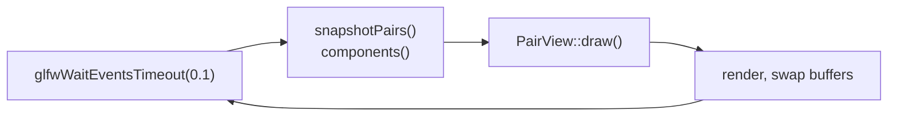

# The GUI

> Describes `gui/*.cpp`, `gui/*.h`, `gui/CMakeLists.txt`.

PairView is a Dear ImGui application in `gui/`. It links the srnp library like
any other component; nothing in `src/` knows it exists.

## Why immediate mode

The window and the pair space are in one process, so the GUI can read the pair
space directly. An immediate-mode toolkit suits that exactly: each frame calls
`snapshotPairs()` and `components()` and draws the result, and there is no
mirrored model to keep in step, no change notification, and no widget touched
from an srnp io thread.

The Qt version this replaces kept its own map of pairs, updated from an srnp
callback — which meant mutating widgets from a non-GUI thread, which Qt forbids.
Its own source carried the fix as a TODO: *"Redundant data. The pairspace can
already give this."* That is what this is.

## The pieces

| File | Holds |
|:-----|:------|
| `main.cpp` | Arguments, GLFW and ImGui setup, the render loop, teardown. |
| `srnp_link.h/.cpp` | Starting the node and keeping it started. |
| `pair_view.h/.cpp` | All the drawing, and the UI's own state. |
| `format.h/.cpp` | Turning pair data into text. No ImGui, so it is unit tested. |
| `theme.h/.cpp` | Fonts, icons, and the style. |

## Threads

Two, and only one of them touches ImGui.

**The render thread** is `main`. It owns the GLFW window, the ImGui context and
everything in `PairView`.

**The connect thread** is the `std::jthread` inside `SrnpLink`. It exists because
`initialize()` blocks for up to ten seconds waiting for the master, which would
freeze the window. It tries, retries every three seconds, and returns once
connected. The render thread reads `state()` and `lastError()` under a mutex.

Beyond that there are srnp's own four io threads, which the GUI never sees: it
registers no callbacks. Nothing srnp does reaches the render thread except
through the pair space, which the render thread reads under the pair-space lock
via `snapshotPairs()`.

The destructor order is what keeps this safe: `SrnpLink`'s destructor joins the
worker before calling `shutdown()`, and `SrnpLink` and `PairView` are both
destroyed inside a scope that ends before the GL context does.

## The frame

```cpp
glfwWaitEventsTimeout(0.1);
```

Not `glfwPollEvents`. The loop blocks until there is input or a tenth of a second
passes, so it redraws immediately when you click and ten times a second when you
do not. Ages stay current and the process is close to idle.



`draw()` takes both snapshots once at the top of the frame and passes them down.
Reading the pair space again halfway through would risk drawing two different
versions of it in one frame.

## State that belongs to the UI

`PairView` holds only what srnp cannot answer: the selection, the filter text,
the post form's fields, the status line, and the handles of per-pair
subscriptions it made. Everything else is read fresh each frame.

The selection is a `PairKey`, not a pointer. Pointers into last frame's snapshot
are dangling by the next one; a key is looked up again each frame and simply
finds nothing when the pair has been deleted, which is exactly what the pane
should say.

## Adding a panel

1. Add the drawing to `pair_view.cpp` as a private method, and call it from
   `draw()`. Give it the snapshot rather than reading the pair space again.
2. Anything that turns data into a string belongs in `gui/format`, not in the
   drawing code, so it can be tested. `tests/test_gui_format.cpp` is where.
3. Use the icons in `theme.h` and give any icon-only control a `tooltip()`.
4. Headings go through `heading()` so they use the heading face.

## Fonts and the style

`theme.cpp` loads IBM Plex Sans and merges Font Awesome 6 Free Solid into the
same atlas, so an icon can be written inline in an ordinary string. Only the
`U+F000`–`U+F2FF` range is rasterised.

Every icon in `theme.h` has its codepoint in a comment and was checked against
the shipped font. Adding one means checking it too — a missing glyph renders as
a blank box, silently.

Sizes are multiplied by the monitor's content scale from
`glfwGetWindowContentScale`, and `ImGuiStyle::ScaleAllSizes` does the same for
padding and rounding, so the window is the same physical size on a HiDPI screen
as on an ordinary one.

The fonts are read from disk at startup: `SRNP_FONT_DIR_INSTALLED` first, then
`SRNP_FONT_DIR_SOURCE`, both compiled in by `gui/CMakeLists.txt`. A build-tree
binary therefore works without installing anything, and an installed one uses the
installed copy. Neither present means ImGui's built-in font and a line on
standard error.

## The build

`gui/CMakeLists.txt` builds ImGui as a static `imgui` target from the five core
sources plus the GLFW and OpenGL3 backends. It deliberately does **not** link
`srnp_warnings`: vendored code under `-Wall -Wextra` produces warnings nobody
here can act on.

The root `CMakeLists.txt` skips the whole directory, with a status line rather
than an error, when `external/imgui` is empty or GLFW and OpenGL are not found.
A machine with no display can still build and test the library.

## What the tests cover

`tests/test_gui_format.cpp` covers `gui/format`: escaping including embedded
nulls and high bytes, the hex dump, age and time formatting, meta-pair parsing,
filter matching, and the error trimming. It is part of `srnp_unit_tests` and does
not need the GUI to be built, since `gui/format` has no ImGui in it.

The drawing itself is not tested. It needs a GL context and a window, and what it
would assert about is pixels. The split exists so that the part worth testing can
be.
