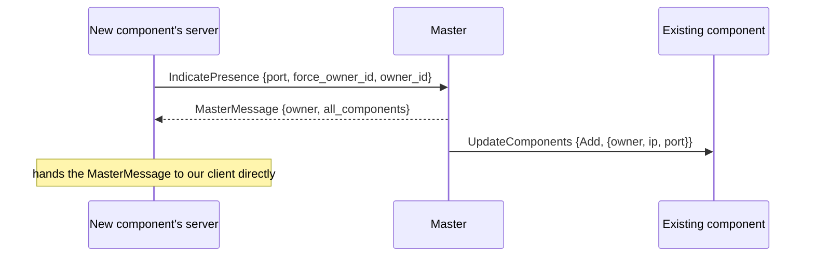
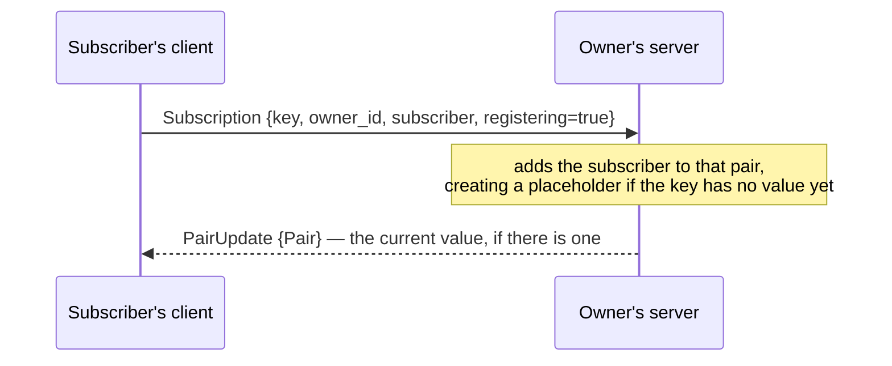
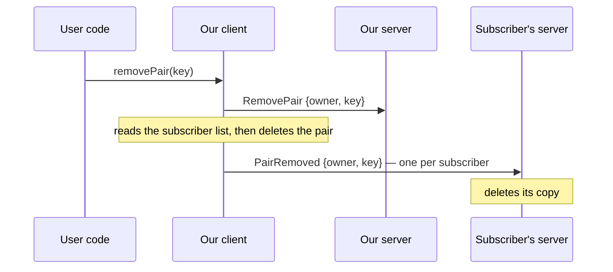

# Protocol

> Describes `include/srnp/wire.h`, `src/wire.cpp`, `include/srnp/msgs/codec.h`,
> `src/codec.cpp`. Those files are the authority if this page disagrees with
> them.

Every message is a 16 byte header followed by an optional payload. All integers
are little-endian. There is no version negotiation: a mismatched version is a
fatal error for that connection.

## The header

| Offset | Size | Field | Notes |
|-------:|-----:|:------|:------|
| 0 | 4 | `magic` | `u32`, always `0x504E5253` — "SRNP" in ASCII. |
| 4 | 1 | `version` | `u8`, always `1`. |
| 5 | 1 | `type` | `u8`, a `MessageType`. |
| 6 | 2 | `flags` | `u16`, always written as 0 and ignored on read. Reserved. |
| 8 | 4 | `payload_length` | `u32`, bytes following the header. |
| 12 | 4 | `subscriber` | `i32`, `-1` except where a message names one component. |

`decodeHeader` rejects a wrong magic, an unknown version, a type of 0 or past the
last known value, and a `payload_length` over `kMaxPayload` (16 MiB). Each of
those throws `wire::DecodeError`, which drops the connection.

The 16 MiB cap exists so a corrupt or hostile peer cannot make us allocate an
arbitrary buffer from a four-byte field.

## Primitive encodings

| Type | Encoding |
|:-----|:---------|
| integers | little-endian, natural width, two's complement for signed |
| `bool` | `u8`, 0 or 1 |
| string | `u32` length, then exactly that many bytes, no terminator |
| time | `i64` nanoseconds since the Unix epoch |

A length prefix rather than a terminator is what lets a value hold embedded nulls
and arbitrary bytes.

Enums are range-checked on decode. A value past the highest known one throws
rather than being cast blindly into the enum type.

## Message types

| Value | Name | Payload | Direction |
|------:|:-----|:--------|:----------|
| 0 | `Invalid` | — | never sent; rejected on receipt |
| 1 | `Subscription` | `Subscription` | client → another component's server |
| 2 | `Pair` | `Pair` | client → another component's server |
| 3 | `PairUpdate` | `Pair` | owner's client → subscriber's server |
| 4 | `IndicatePresence` | `IndicatePresence` | component's server → master |
| 5 | `MasterMessage` | `MasterMessage` | master → component's server |
| 6 | `UpdateComponents` | `UpdateComponents` | master → component's server |
| 7 | `RemovePair` | `RemovePairRequest` | client → the owning component's server |
| 8 | `PairRemoved` | `RemovePairRequest` | owner's client → subscriber's server |

Every message on this list crosses a real network connection. Version 1 had
three more — `PairNoCopy`, `PairUpdateOne` and `AttachClient` — which only ever
travelled the loopback connection between a component's own client and server.
That connection is gone, and so are they. See [Internals](internals.md).

## Payload layouts

### `Pair`

| Field | Encoding |
|:------|:---------|
| `owner` | `i32` |
| `key` | string |
| `value` | string |
| `type` | `u8`: 0 `Invalid`, 1 `String`, 2 `Bytes`, 3 `Meta` |
| `write_time` | `i64` nanoseconds |
| `expiry_time` | `i64` nanoseconds |

Subscribers and callbacks are deliberately not encoded. Both are local
bookkeeping and mean nothing to the component receiving the pair.

`expiry_time` is carried, stored and readable, and acted on by nothing.

### `Subscription`

| Field | Encoding |
|:------|:---------|
| `key` | string; `"*"` is the wildcard |
| `owner_id` | `i32`, whose pair is wanted |
| `subscriber` | `i32`, who wants it |
| `registering` | `bool`; false cancels |

### `RemovePairRequest`

| Field | Encoding |
|:------|:---------|
| `owner` | `i32` |
| `key` | string |

### `IndicatePresence`

| Field | Encoding |
|:------|:---------|
| `port` | string, the port our server listens on |
| `force_owner_id` | `bool` |
| `owner_id` | `i32`, meaningful only when forcing |

### `ComponentInfo`

| Field | Encoding |
|:------|:---------|
| `owner` | `i32` |
| `ip` | string |
| `port` | string |

### `UpdateComponents`

| Field | Encoding |
|:------|:---------|
| `operation` | `u8`: 0 `Add`, 1 `Remove` |
| `component` | `ComponentInfo` |

### `MasterMessage`

| Field | Encoding |
|:------|:---------|
| `owner` | `i32`, the id being assigned |
| `count` | `u32` |
| `all_components` | `count` × `ComponentInfo` |

`count` is checked against what the payload could plausibly hold before anything
is allocated for it.

A decoded payload must be consumed exactly. Trailing bytes are an error, and so
is running out early.

## Flows

### A component joining



The master replies with everyone who registered *before* this component, not
including the component itself. Existing components learn about the new one from
`UpdateComponents` instead. The master rewrites `127.0.0.1` to the address the
component used to reach it, so a loopback address seen by the master is still
reachable from elsewhere.

### Subscribing



The immediate send is what makes a late subscriber correct: it gets the current
value without waiting for the next write. A wildcard subscription sends every
pair the component owns that has a value.

Cancelling is the same message with `registering = false`, and sends nothing
back.

### A value update

```mermaid
sequenceDiagram
    participant U as User code
    participant C as Our client
    participant P as Subscriber's server
    U->>C: setPair(key, value)
    Note over C: applies it and queues the frames under one lock
    C->>P: PairUpdate {Pair}
    Note over C: callbacks posted to the callback strand
    Note over P: applies it, runs callbacks; does not forward it on
```

A subscriber never forwards a pair it received — it is not the owner.

`setRemotePair` takes a different route: the client sends `Pair {…}` straight to
the target component's server, which applies it, takes ownership, and fans it out
to its own subscribers exactly as above.

### A removal



The subscriber list has to be read before the deletion, because the deletion is
what takes it away.

`removeRemotePair` sends the same `RemovePair` message to the owner's server
instead of to our own, and the rest is identical.

A server ignores a `RemovePair` whose `owner` is not its own id, so a component
cannot be made to delete a pair it is only holding a copy of.
