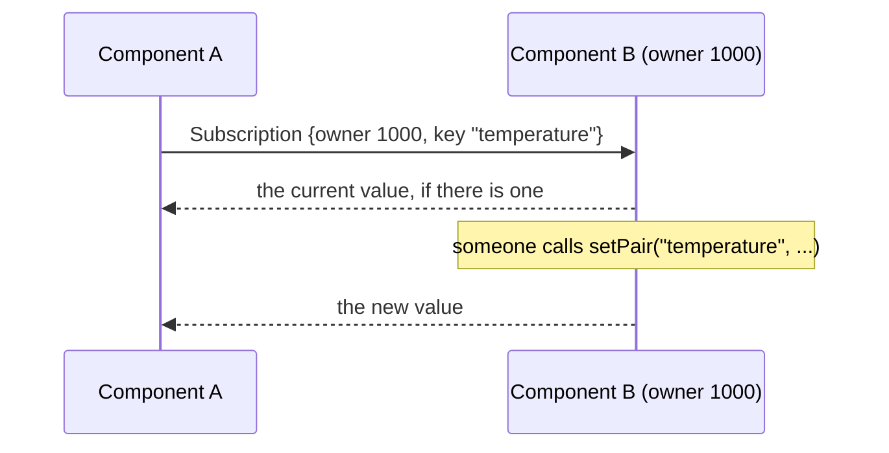
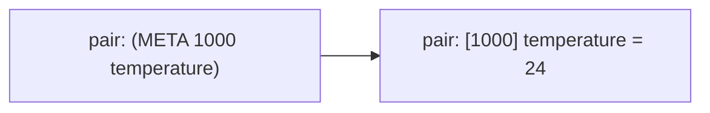

# Concepts

## Components and owner ids

A component is one process running an srnp node. When it starts it registers with
the master, which gives it an **owner id** — a number between 1000 and 10000,
derived from the port it listens on so a component restarting on the same port
usually keeps its id. `--owner-id <n>` asks for a specific one instead; the
master honours it unless that id is taken.

The id is how components address each other. `srnp::getOwnerID()` returns yours.

## Pairs

A pair is a key, a value, and the owner it belongs to. `<owner, key>` together
identify it: two components can both publish `status` without colliding.

A pair also carries a type, a write time, and an expiry time.

| Field | Meaning |
|:------|:--------|
| `owner` | Which component published it. |
| `key` | A string. Slashes are not special; there is no hierarchy. |
| `value` | A string, which may hold arbitrary bytes including nulls. |
| `type` | `String`, `Bytes`, or `Meta`. `Invalid` is internal. |
| `write_time` | Set by the owner's node when the value lands. |
| `expiry_time` | **Carried but never acted on. See below.** |

`expiry_time_` is encoded, sent, decoded and stored, and `getExpiryTime()` reads
it back. Nothing anywhere expires a pair or checks the field. It is a field in
the wire format and nothing more — do not build anything on it.

## The pair space

Each component holds one pair space: the pairs it published, plus copies of every
pair it subscribed to. There is no central store. `srnp::printPairSpace()` dumps
it; `srnp::snapshotPairs()` returns a copy you can walk.

A component only ever publishes under its own id. `setPair` stamps your owner id
on the pair regardless of what you pass, and a pair pushed to another component
with `setRemotePair` becomes that component's pair the moment it lands.

## Subscriptions

A subscription tells another component "send me this pair whenever it changes".
Without one, you never see anyone else's pairs.

Three forms:

- `registerSubscription(owner, key)` — that key on that one component.
- `registerSubscription(key)` — that key on **every** component, including ones
  that join later.
- `registerSubscription(owner, "*")` — every key that component owns.

Subscribing to a key nobody has published yet is fine. The subscription is held
and the first value delivered when it appears. Removing a pair does not cancel
the subscription either: re-publishing the same key reaches the same subscribers.

Subscriptions are replayed automatically to components that connect after you
registered, so there is no ordering requirement between components starting.

## Callbacks

A callback runs in your process when a pair changes.

`registerCallback(owner, key, fn)` matches one exact owner and key. Unlike a
subscription, it does **not** accept `kAnyOwner` as a wildcard — a callback
registered against `kAnyOwner` waits for a pair literally owned by -1 and never
fires. If you do not know the publisher's id in advance, use
`registerCallback(owner, "*", fn)`, which fires for every pair the node receives
and lets you filter inside the callback.

A callback needs a subscription behind it for anyone else's pair. The
subscription is what makes the value arrive; the callback only reacts to it.

Callbacks run on an srnp io thread, outside the pair-space lock. A slow callback
delays that thread's other work but does not block the pair space.

## Meta-pairs

A meta-pair is an ordinary pair whose value is `(META <owner> <key>)`, naming
another pair. It is a pointer, and the point of it is indirection: a component
can be told what to watch at runtime instead of at compile time.

`setMetaPair(meta_owner, meta_key, owner, key)` points one at a target, and
`initMetaPair` creates one pointing nowhere. `getPairIndirectly` and
`setPairIndirectly` follow the pointer in one step.

`registerMetaCallback` goes further: it follows the pointer as it changes, moving
the subscription and callback to the new target when the meta-pair is repointed.

## What the master does

- Hands out owner ids.
- Tells every component about every other component's address.
- Notices when a component disconnects, and tells the others.

## What the master does not do

- Carry pairs. Not one ever passes through it.
- Persist anything. Restarting the master loses the component list; the
  components themselves keep their pairs.
- Route updates. Components talk to each other directly.

A master that dies takes no pairs with it, but components can no longer learn
about new ones.

## PEIS equivalents

srnp began as a reimplementation of the PEIS Kernel. For anyone coming from it:

| PEIS | srnp |
|:-----|:-----|
| `peiskmt_initialize` | `srnp::initialize` |
| `peiskmt_subscribe` | `srnp::registerSubscription` |
| `peiskmt_registerTupleCallback` | `srnp::registerCallback` |
| `peiskmt_setStringTuple` | `srnp::setPair` |
| `peiskmt_setRemoteStringTuple` | `srnp::setRemotePair` |

The concepts were taken, not the code or the wire format. The two do not
interoperate.

## Delivery

A pair is a value, not an event stream. Subscribers are told when it changes,
but srnp promises only that a subscriber converges on the **current** value —
not that it sees every value the publisher passed through.

That distinction only becomes visible under load. Each connection holds a
bounded send queue. While a subscriber keeps up it receives every update. Once
it falls far enough behind that the queue fills, a new update for a key already
waiting **replaces** it: the subscriber never sees the superseded value. In a
saturating benchmark on one key, roughly three in four published values are
superseded this way.

This is what a blackboard means, and it is what keeps a publisher from growing
without limit behind a subscriber that has stopped reading. Subscriptions and
deletions are never dropped — only pair values coalesce, because only a pair
value has a newer version that makes the older one redundant.

If you need every intermediate value, put a sequence number in the value and
have the subscriber detect the gaps, or send events through something built for
events.
