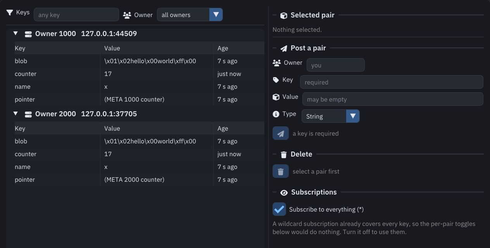
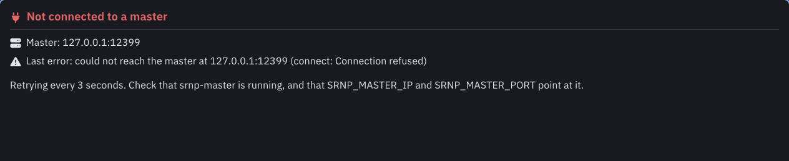
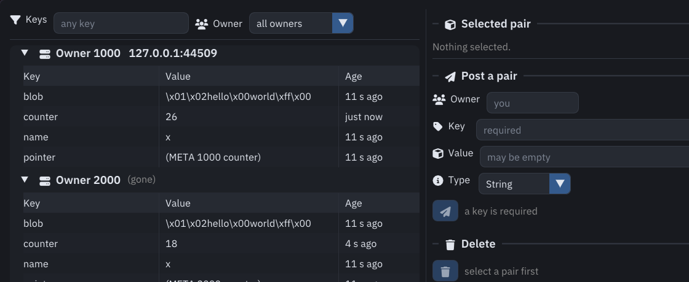

# PairView

PairView is a window onto the pair space. It shows every pair this node holds,
grouped by the component that owns it, and lets you write pairs, delete them,
and change what you are subscribed to.



It is a full srnp component itself. It registers with the master, gets its own
owner id, and holds a standing wildcard subscription — which is how anyone
else's pairs reach it at all. Nothing is mirrored: each frame reads the pair
space and draws what is there.

## Running it

```bash
export SRNP_MASTER_IP=127.0.0.1
export SRNP_MASTER_PORT=12321
pairview
```

| Argument | Effect |
|:---------|:-------|
| `--master-ip IP` | The master's address. Overrides `SRNP_MASTER_IP`. |
| `--master-port PORT` | The master's port. Overrides `SRNP_MASTER_PORT`. |
| `--owner-id N` | Ask for a specific owner id. |
| `--help` | Print the usage and exit. |

With neither the environment nor an argument, it tries `127.0.0.1:12321`.

The window opens before the connection is made, so it never appears frozen. If
the master is not there it says so, with the address it tried and why the last
attempt failed, and retries every three seconds.



## The tree

The left side lists every pair, under a heading per component. The heading shows
the owner id, and then:

- **`ip:port`** — where that component is, from the master's list.
- **`(you)`** — PairView's own pairs.
- **`(gone)`** — the master no longer lists that component, but the pairs it
  published are still in our space. Their ages stop advancing, which is the
  quickest sign that a component died.



Each row is a key, its value, and how long ago it was written. Values are
escaped before being drawn: a null becomes `\x00`, a byte with the high bit set
becomes `\xff`, and a newline becomes `\n`. Nothing is passed through raw, so a
binary value cannot corrupt the display. Long values are cut with an ellipsis;
the whole value is in the detail pane.

Two filters sit above the tree: **Keys**, a case-insensitive substring match on
the key, and **Owner**, which narrows to one component.

Click a row to select it.

## The detail pane

The selected pair in full:

- Owner, key and type.
- When it was written, as a timestamp and as an age.
- Expiry — shown, and labelled *never enforced*, because
  [nothing acts on that field](concepts.md#pairs).
- The whole value, escaped.
- For a `Bytes` pair, a hex dump with a printable column.

When the value is a meta-pair — `(META <owner> <key>)` — the pane names the pair
it points at and offers a button that selects the target and opens its component
in the tree.

## Posting a pair

| Field | Meaning |
|:------|:--------|
| Owner | Blank publishes under PairView's own id. Another id sends the pair to that component, which then owns it. |
| Key | Required. |
| Value | May be empty. |
| Type | `String`, `Bytes` or `Meta`. |

The send button is disabled until there is a key. What happened appears
underneath: a tick for a pair that went out, a cross with the reason for one that
did not — usually that the target component is not connected.

## Deleting a pair

The bin button deletes the selected pair. Because a deletion cannot be undone, it
asks first, naming the pair.

Deleting one of PairView's own pairs calls `removePair`; deleting another
component's calls `removeRemotePair`, which asks the owner to delete it. Either
way its subscribers are told the pair is gone.

A subscription outlives the deletion. If the owner publishes that key again, it
arrives as normal without anyone re-subscribing.

## Subscriptions

**Subscribe to everything (\*)** is on at startup, and is what makes other
components' pairs appear at all. It is a wildcard subscription: every key, every
component, including ones that join later.

While it is on, the per-pair toggles are disabled and the window says why — a
wildcard subscription already covers every key, so a per-key toggle underneath it
would change nothing.

Turn it off and the wildcard is cancelled. Pairs already in the space stay, but
they stop updating. You can then subscribe to individual pairs: select one and
use the subscribe button, and each subscription gets its own toggle for
cancelling it again.

## Icons and tooltips

Controls that are only an icon have a tooltip saying what they do. Hover to read
it.

| Icon | Means |
|:-----|:------|
| Funnel | The key filter. |
| People | An owner, or the owner filter. |
| Server | A component heading. |
| Paper plane | Post the pair. |
| Bin | Delete the selected pair. |
| Eye | Subscriptions. |
| Chain | A meta-pair's target. |
| Arrow | Jump to that target. |

## Building it

PairView is built by default, as long as GLFW, OpenGL and the vendored Dear
ImGui are present:

```bash
git submodule update --init
cmake -S . -B build
cmake --build build -j
```

If the submodule is missing or GLFW is not installed, cmake prints a line saying
PairView was skipped and carries on building the library. `-DSRNP_BUILD_GUI=OFF`
skips it deliberately.

The interface uses IBM Plex Sans and Font Awesome, both shipped in `gui/fonts`
and installed alongside the binary. If neither the installed copy nor the source
tree can be found, PairView falls back to Dear ImGui's built-in font and says so
on standard error.
